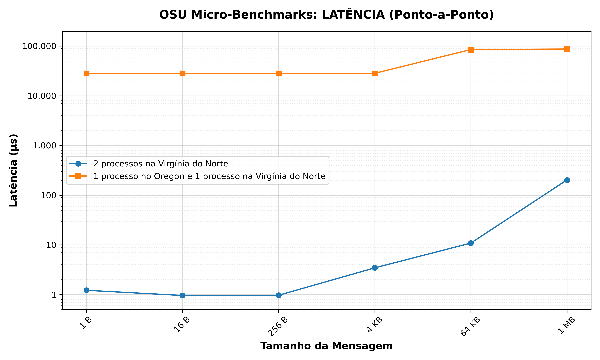

# Ambiente na Nuvem (AWS)

Este diretório contém as instruções e dados do laboratório em nuvem. Usamos a AWS para medir a latência de comunicação entre dois processos MPI em cenários diferentes: dentro de uma mesma máquina e entre duas máquinas em regiões distantes.

## O que foi feito

Criamos duas instâncias `t2.micro` (1 vCPU, 1 GB de RAM) em regiões diferentes dos EUA:

- **Virgínia do Norte** (`us-east-1`)
- **Oregon** (`us-west-2`)

A distância entre elas é de aproximadamente 4.000 km. Executamos o benchmark `osu_latency`, que funciona no modelo ping-pong: um processo envia uma mensagem (`MPI_Send`) e o outro devolve (`MPI_Recv`). O tempo reportado é a média de 100 iterações para cada tamanho de mensagem.

## Configuração de Infraestrutura (Passo a Passo)

Para que o laboratório funcione, a rede deve ser configurada manualmente para permitir a comunicação inter-regional privada.

### 1. VPC (Virtual Private Cloud)
Crie uma VPC em cada região com blocos CIDR distintos para evitar conflitos:
- **Virgínia:** `10.0.0.0/16`
- **Oregon:** `10.1.0.0/16`
*Certifique-se de criar uma Subnet pública e um Internet Gateway anexado para permitir o acesso SSH.*

### 2. VPC Peering
O Peering conecta as duas redes de forma privada:
1. Na Virgínia, solicite o **Peering Connection** para a VPC do Oregon.
2. No Oregon, aceite a solicitação.
3. **Rotas:** Em cada região, adicione uma rota na *Route Table* apontando o CIDR da outra região para o ID do Peering (`pcx-xxxx`).

### 3. Security Groups (Firewall)
Configure as regras de entrada para permitir o tráfego do MPI:
- **SSH (Porta 22):** Liberado para o seu IP.
- **TCP (Portas 1024-65535):** Liberado para o CIDR da VPC oposta (ex: na Virgínia, libere para `10.1.0.0/16`).

### 4. Configuração das Instâncias (Amazon Linux 2023)
Após subir as instâncias, instale as dependências:
```bash
sudo dnf update -y
sudo dnf install -y gcc gcc-c++ make openmpi openmpi-devel
echo 'export PATH=$PATH:/usr/lib64/openmpi/bin' >> ~/.bashrc
source ~/.bashrc
```

### 5. Chaves SSH
Gere uma chave no nó da Virgínia (`ssh-keygen`) e adicione o conteúdo da `id_rsa.pub` ao arquivo `authorized_keys` no nó do Oregon para permitir o acesso sem senha.

## Como rodar o teste

A execução é feita a partir da instância na Virgínia do Norte:

```bash
mpirun --hostfile hostfile_aws \
  --mca pml ob1 \
  --mca btl tcp,self \
  --mca btl_tcp_disable_family IPv6 \
  --map-by node -np 2 ./osu_latency
```

### Parâmetros:
- `--mca pml ob1`: Seleciona a camada de mensagens ponto a ponto.
- `--mca btl tcp,self`: Usa TCP para rede e comunicação interna.
- `--mca btl_tcp_disable_family IPv6`: Desabilita IPv6 (as VPCs usam só IPv4).

## Resultados

| Cenário | Latência Mínima | Latência Máxima |
| :--- | :--- | :--- |
| **1. Local (Virgínia)** | 0,92 µs | 202,66 µs |
| **2. Inter-regional (Oregon)** | 28,27 ms | 87,17 ms |



## Dados e Scripts

Os dados estão na pasta `dados/` e o script Python utilizado para processar os resultados e gerar o gráfico comparativo está em `scripts/`.
