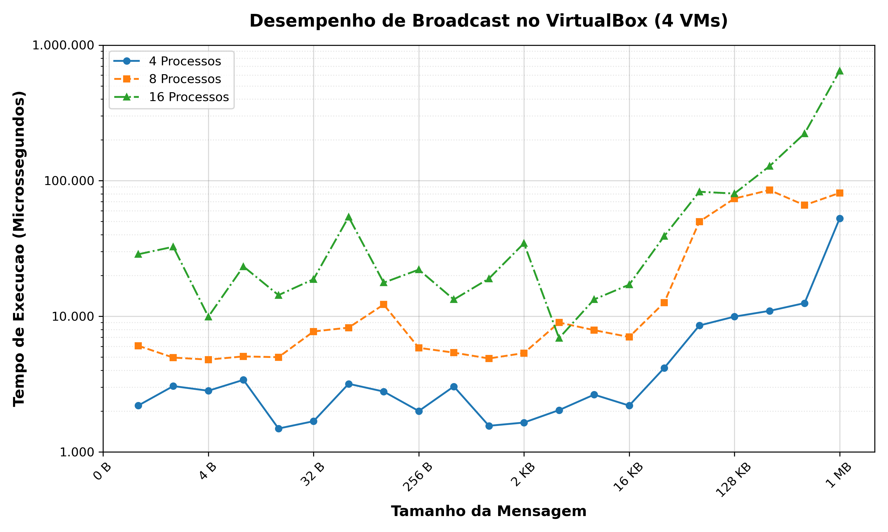

# Ambiente Local (VirtualBox)

Este diretório contém os recursos necessários para provisionar e testar um cluster local utilizando o **VirtualBox** e o **Vagrant**, conforme descrito no artigo.

## Requisitos de Sistema

Para a replicação dos experimentos em ambiente local, foi utilizado um computador com as seguintes características:

- **Sistema Operacional:** Windows 11
- **Processador:** Intel Core i7
- **Memória RAM:** 32 GB
- **Armazenamento:** SSD de 500 GB
- **Software:** VirtualBox (versão 7.0) e Vagrant instalados.

A Tabela 2, extraída do artigo, detalha o consumo estimado de recursos para o ambiente de virtualização:

| Componente            | Consumo (GB) | Disco (GB)    |
| :-------------------- | :----------- | :------------ |
| Windows 11 (base)     | 4,0          | 64,0          |
| 4 VMs Ubuntu (1 GB cada) | 3,5 – 4,0    | 37,0          |
| Gerenciamento VBox/Rede | 0,5          | 0,2 – 0,3     |
| **Total Estimado**    | **8,0 – 8,5**| **101,2 – 101,3** |

## 1. Provisionamento do Cluster

A infraestrutura é definida via *Infrastructure as Code* (IaC) através do arquivo `Vagrantfile`, que automatiza a criação de 4 instâncias virtuais (Ubuntu 22.04 Server). O script realiza a configuração da rede interna (Host-Only) e o *provisioning* automático das dependências do OpenMPI em todos os nós.

### Procedimento de Instalação e Setup

1. Abra o **PowerShell como Administrador** e navegue até a raiz deste diretório.
2. Caso ainda não possua o Vagrant instalado, execute o comando via Gerenciador de Pacotes do Windows (`winget`):
   ```powershell
   winget install --id Hashicorp.Vagrant
   ```
   *Nota: Pode ser necessário reiniciar o terminal após a instalação para atualizar as variáveis de ambiente.*

3. Inicie o provisionamento do cluster:
   ```bash
   vagrant up
   ```
4. O processo realizará automaticamente o download da *box* oficial do Ubuntu, a configuração dos adaptadores de rede e o deploy dos scripts de instalação. Aguarde a conclusão da subida dos 4 nós (`node1`, `node2`, `node3`, `node4`).

## 2. Execução dos Experimentos (Benchmark de Broadcast)

No ambiente local, o foco dos testes foi a análise de latência em operações coletivas de **Broadcast**, utilizando o benchmark `osu_bcast`.

### Procedimento de Execução

1. Acesse o nó principal (`server1` ou `node1`) via SSH:
   ```bash
   vagrant ssh node1
   ```

2. Navegue até o diretório dos benchmarks coletivos:
   ```bash
   cd /home/vagrant/osu-micro-benchmarks-7.3/c/mpi/collective/blocking
   ```

3. Execute o benchmark variando a quantidade de processos (`-np`) para 4, 8 e 16. Exemplo de comando utilizado:
   ```bash
   mpirun -np 4 --hostfile ~/hostfile --oversubscribe --mca btl tcp,self --mca btl_tcp_if_include 192.168.56.0/24 --mca mpi_yield_when_idle 1 ./osu_bcast
   ```

### Detalhamento dos Parâmetros

Para garantir a precisão dos resultados e a correta comunicação entre os nós virtuais, os seguintes parâmetros foram empregados no `mpirun`:

- `-np [4, 8, 16]`: Define o número de processos MPI a serem lançados no cluster.
- `--hostfile ~/hostfile`: Especifica o arquivo contendo os endereços IP dos nós (`node1` a `node4`), permitindo que o MPI distribua os processos entre as VMs.
- `--oversubscribe`: Permite o lançamento de mais processos do que o número de slots (núcleos) disponíveis. 
- `--mca btl tcp,self`: Força o uso da camada de transporte TCP para comunicação entre nós e `self` para comunicação interna, garantindo que o tráfego passe pela pilha de rede virtualizada.
- `--mca btl_tcp_if_include 192.168.56.0/24`: Restringe a comunicação MPI à interface de rede interna do VirtualBox (Host-Only), evitando interferências de outras interfaces.
- `--mca mpi_yield_when_idle 1`: Instrui o processo MPI a liberar o processador quando estiver em espera, otimizando o escalonamento em ambientes virtualizados onde há disputa por CPU física.
- `./osu_bcast`: O executável do benchmark de broadcast que mede a latência média de envio de mensagens de diferentes tamanhos para todos os nós do grupo.

## 3. Processamento de Dados e Visualização

A visualização dos resultados é realizada através de script Python localizado no diretório `scripts/`. Este script foi desenvolvido para processar os dados coletados durante as execuções do cluster local.

### Estrutura de Dados e Scripts
A organização dos resultados experimentais e ferramentas de visualização é composta por:

- **Pasta `dados/`**: Contém o arquivo `dados_vbox.md`. Este documento atua como um relatório técnico consolidando os resultados (tabelas de latência) obtidos diretamente do cluster local para consulta.
- **Pasta `scripts/`**: Contém o script Python `plot_latencia.py`. 

### Geração dos Gráficos
Para assegurar o experimento apresentado no artigo, o script de plotagem utiliza os dados consolidados localmente (*hardcoded*).

1. No seu computador hospedeiro (fora das VMs), navegue até a pasta de scripts:
   ```bash
   cd virtualbox/scripts/
   ```
2. Execute o script de geração:
   ```bash
   python3 plot_latencia.py
   ```
3. O script exportará automaticamente os gráficos em alta resolução (nos formatos **PNG** e **PDF**) para o diretório `graficos/`.

## 4. Cenário de Execução: Comunicação em Grupo (Broadcast)

Como exemplo de uso do laboratório com VirtualBox, foi utilizado o benchmark `osu_bcast`. Este teste executa uma sequência de cem chamadas da função `MPI_Bcast` e reporta a média do tempo de execução de cada uma delas. Nos experimentos realizados, o processo raiz (*root*) foi mantido fixo no `rank 0`.

O benchmark foi executado com cargas de **4, 8 e 16 processos**, distribuídos igualmente entre as 4 máquinas virtuais do cluster local. Cada execução variou o tamanho da mensagem de 1 byte até 1 megabyte.

A Figura 1 (abaixo) apresenta os resultados deste experimento:

![Figura 1: Latência de Broadcast no Cluster VirtualBox]
### Análise Técnica
Observa-se que o tempo de execução tende a aumentar proporcionalmente ao tamanho da mensagem e ao número de processos ativos. Contudo, foram identificadas pequenas anomalias (ex: mensagens de 256 B com 4 processos), atribuídas a processos concorrentes no sistema operacional hospedeiro, o que reforça a necessidade de uma análise mais detalhada.

Para detalhes dos dados brutos e scripts de plotagem, consulte as pastas `dados/` e `scripts/`.
```
